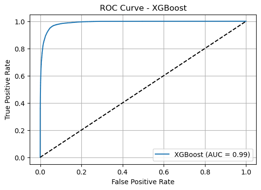

# Loan Default Risk Prediction Using Machine Learning

**Domain:** Financial Services — Credit Risk Assessment  
**Tools:** Python · XGBoost · SHAP · SMOTE · PCA · Scikit-learn  
**Dataset:** Lending Club (2007–2018) — 2.2M records · 150+ features  
**Best Model:** XGBoost — ROC-AUC: 0.99 · Recall: 0.90 · Precision: 0.89  

---

## Business Problem

Credit default prediction is one of the most critical 
challenges in financial services. Lenders need to 
identify high-risk borrowers accurately before issuing 
loans — minimising losses while maintaining fair and 
inclusive lending practices.

This project builds an end-to-end machine learning 
pipeline to predict loan default risk using real 
peer-to-peer lending data from Lending Club, following 
the CRISP-DM methodology.

---

## Key Results

| Model | Accuracy | ROC-AUC | Recall | F1-Score |
|---|---|---|---|---|
| Logistic Regression | 0.91 | 0.94 | 0.94 | 0.75 |
| Random Forest | 0.94 | 0.98 | 0.84 | 0.87 |
| **XGBoost** | **0.95** | **0.99** | **0.90** | **0.89** |

XGBoost outperformed all models across every metric 
and was selected as the production candidate.

---

## Project Pipeline

**1. Data Collection & Sampling**
- 2.2M records from Lending Club (2007–2018)
- Random sample of 300,000 rows to ensure 
  representative distribution
- Target variable: loan_status 
  (80% fully paid / 20% defaulted)

**2. Data Preprocessing**
- Dropped columns with 30%+ missing values
- Median imputation for remaining nulls
- Removed data leakage features
- One-hot encoding for categorical variables
- Final feature set: 873 engineered features

**3. Statistical Analysis**
- Two-sample Z-tests on key financial variables
- Interest rate showed strongest discriminative 
  power (Z = -147.17, p < 0.001)
- Annual income, loan amount, and installment 
  all statistically significant at p < 0.001

**4. Class Imbalance — SMOTE**
- Applied Synthetic Minority Over-sampling 
  Technique to address 80/20 class split
- Improved model ability to detect defaulters

**5. Dimensionality Reduction — PCA**
- Reduced 873 features to 764
- Retained 95% of total variance
- Improved training speed without losing 
  predictive power

**6. Model Development**
- Logistic Regression (baseline)
- Random Forest with GridSearchCV tuning
- XGBoost with GridSearchCV tuning

**7. Model Interpretability — SHAP**
- Applied SHAP values to XGBoost predictions
- Identified key drivers: FICO score, 
  last payment amount, loan term
- Fairness audit on sensitive attributes 
  including home ownership and employment status

---

## Key Findings

- High interest rate is the strongest predictor 
  of default — borrowers paying higher rates 
  default significantly more often
- FICO credit score and recent payment behaviour 
  are the most influential features in the model
- XGBoost with SHAP delivers both high accuracy 
  and transparent, auditable predictions — 
  suitable for regulated financial environments
- The pipeline is deployment-ready with 
  serialisation, API, and monitoring architecture 
  fully planned

---

## Financial Services Relevance

This project demonstrates skills directly applicable 
to roles in:

- Credit risk analytics
- Retail and commercial banking
- Insurance underwriting analytics
- Fintech and peer-to-peer lending platforms
- Regulatory compliance and fair lending analysis

---

## Tools & Technologies

| Category | Tools Used |
|---|---|
| Language | Python 3 |
| Data Manipulation | Pandas, NumPy |
| Machine Learning | Scikit-learn, XGBoost |
| Class Balancing | imbalanced-learn (SMOTE) |
| Dimensionality Reduction | PCA (Scikit-learn) |
| Model Interpretability | SHAP |
| Visualisation | Matplotlib, Seaborn |
| Environment | Jupyter Notebook |
| Methodology | CRISP-DM |

---

## Files

| File | Description |
|---|---|
| `Lending_Club_Loan_Code.ipynb` | Full Jupyter Notebook with code |
| `Loan_Default_Prediction_Report.docx` | Detailed project report |
| `README.md` | Project summary and documentation |

---

## Dataset

Lending Club Loan Dataset — available on Kaggle  
2.2 million loan records from 2007 to 2018  
150+ features covering borrower demographics, 
financial indicators, and loan characteristics

---

## Author

**Ilham Oussanna**  
Data Analyst | SQL · Python · Power BI · Machine Learning  
Higher Diploma in Science in Data Analytics — 
National College of Ireland (2.1 Honours, 2025)  
Navan, Co. Meath, Ireland  
[LinkedIn Profile] | [GitHub Profile]
